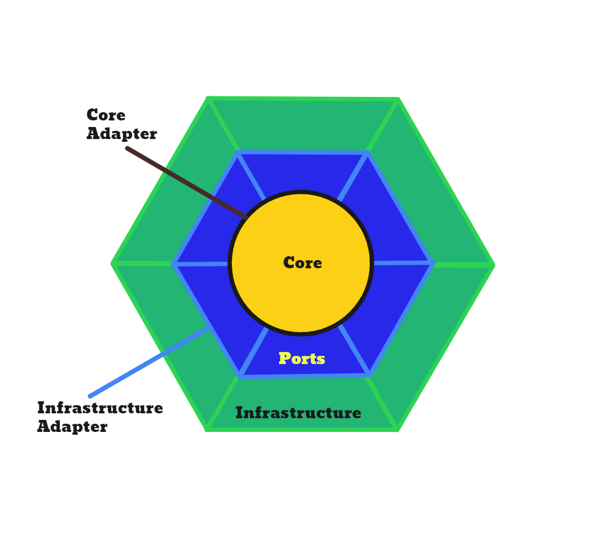
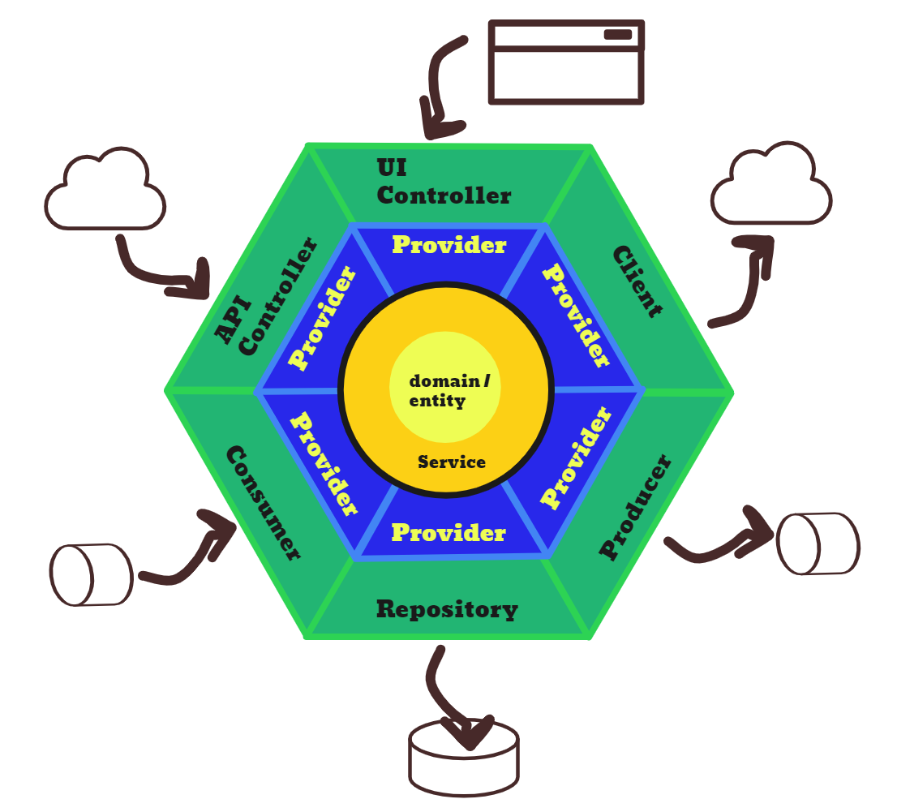

# Hexagonal with Onion Core Architecture

## Overview

This is an exercise kotlin project to create an Hexagonal with Onion Core Architecture.

| Main Layers | Detailed Layers |
| --- | --- |
|  |  |

There are three main layers:

- `core:` It consists of the domain/entity layer, service layer, and provider layer
    - `domain/entity` It is the center part of the architecture. It represents the application domain objects.
    - `service` It holds the business logic and also "protects" application domain objects. It also provides the
      communication logic between domain objects and the infrastructure.
- `ports` It consists of provider interfaces
    - `provider` It provides interfaces that serve as "ports" for the `infrastructure` to communicate with the `core`
      layer and vice versa.
- `infra:` It consists of the controller layer, repository layer, or other layers that is responsible for outside the
  application communication.
    - `controller` It is the REST API controller that is responsible for incoming requests of the application. It has its
      own `model` which serves its request and response model for the communication. These models implement the
      interfaces from the `provider` so that it can interact with the provided `service` from the `core`.
    - `repository` It is responsible for the communication with the database of the application.